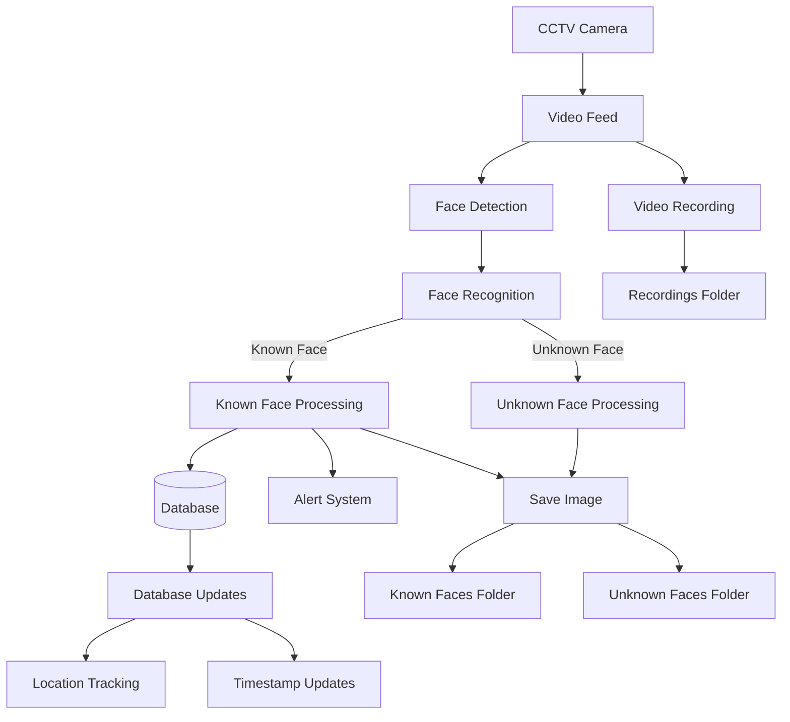
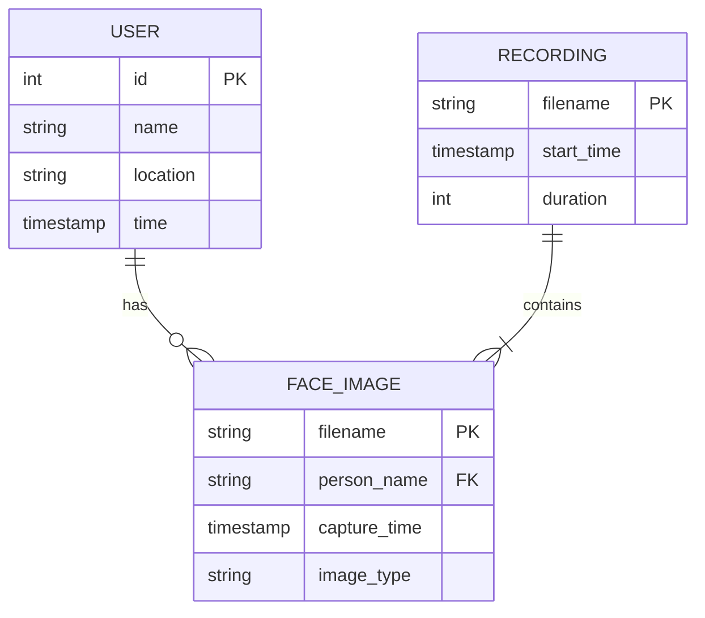

# jjhjnh

# Data Flow Diagram

# Entity Relationship Diagram

System Components Description:

1. **User Management**
   - Primary key: ID (Auto-incrementing)
   - Stores user name, current location, and timestamp
   - Updated in real-time during face recognition

2. **Face Images**
   - Stored in separate folders for known/unknown faces
   - Filename includes person name and timestamp
   - Linked to user records for known faces

3. **Video Recordings**
   - Continuous recording in configurable duration segments
   - Stored with timestamp-based filenames
   - Contains multiple captured faces

4. **Real-time Processing**
   - Video capture from CCTV camera
   - Face detection and recognition
   - Alert system for recognized faces
   - Database updates for location tracking
