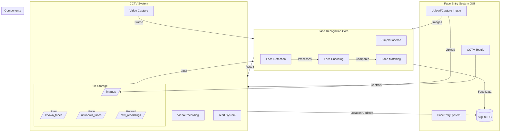

# Face Recognition CCTV System Architecture

# Key Components

## 1. Face Entry System (GUI)
- Manages user registration
- Handles image capture/upload
- Controls CCTV system
- Displays recognition results

## 2. Face Recognition Core
- Loads and manages face encodings
- Performs face detection
- Matches faces against database
- Returns recognition results

## 3. CCTV System
- Captures video feed
- Records surveillance footage
- Triggers alerts for recognized faces
- Stores face images and recordings

## 4. Storage System
- SQLite database for user data
- Image directory for training data
- Separate folders for known/unknown faces
- CCTV recordings archive

## 5. Data Flow
- Images → Face Recognition → Database
- Video Feed → Face Detection → Recognition → Alert
- Recognition Results → Database Updates
- Face Images → File Storage
